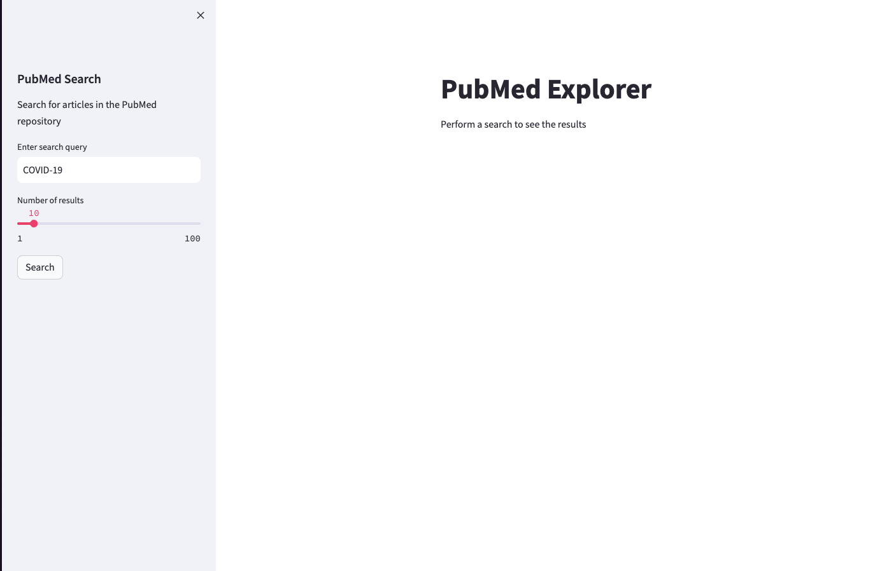
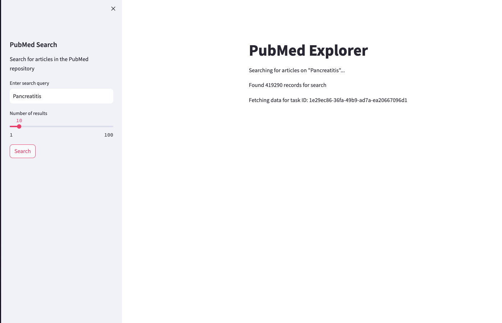
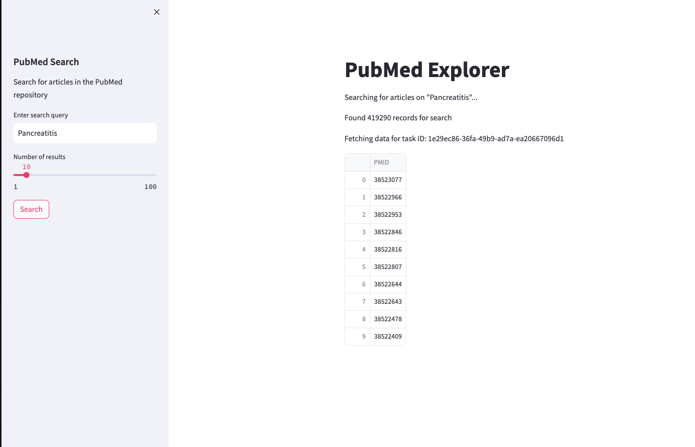

# PubMed Explorer ⚕️

This is a new easy way to explore PubMed repository.

# Demo Application
[Access a running demo of the project hosted on Google Cloud](http://35.209.74.188:8501/)

## Screenshots

Initial screen:


After searching for "pancreatitis" a new task is dispatched and the basic information about the results is shown (number of records found in the search):


After the task is completed, the results are shown in a table (in this demo only showing the PMIDs of the articles):


## How to run the app

1. Clone the repository
2. Run the following command to build the docker containers with all the applications (streamlit frontend, flask backend, celery worker, and redis server)
```bash
docker-compose up
```
3. Open the browser and go to `http://localhost:8501/` and you will see the app running.
4. Enjoy!
5. You can also check the tasks being dispatched by accessing Redis Commander at `http://localhost:8081/`
  
